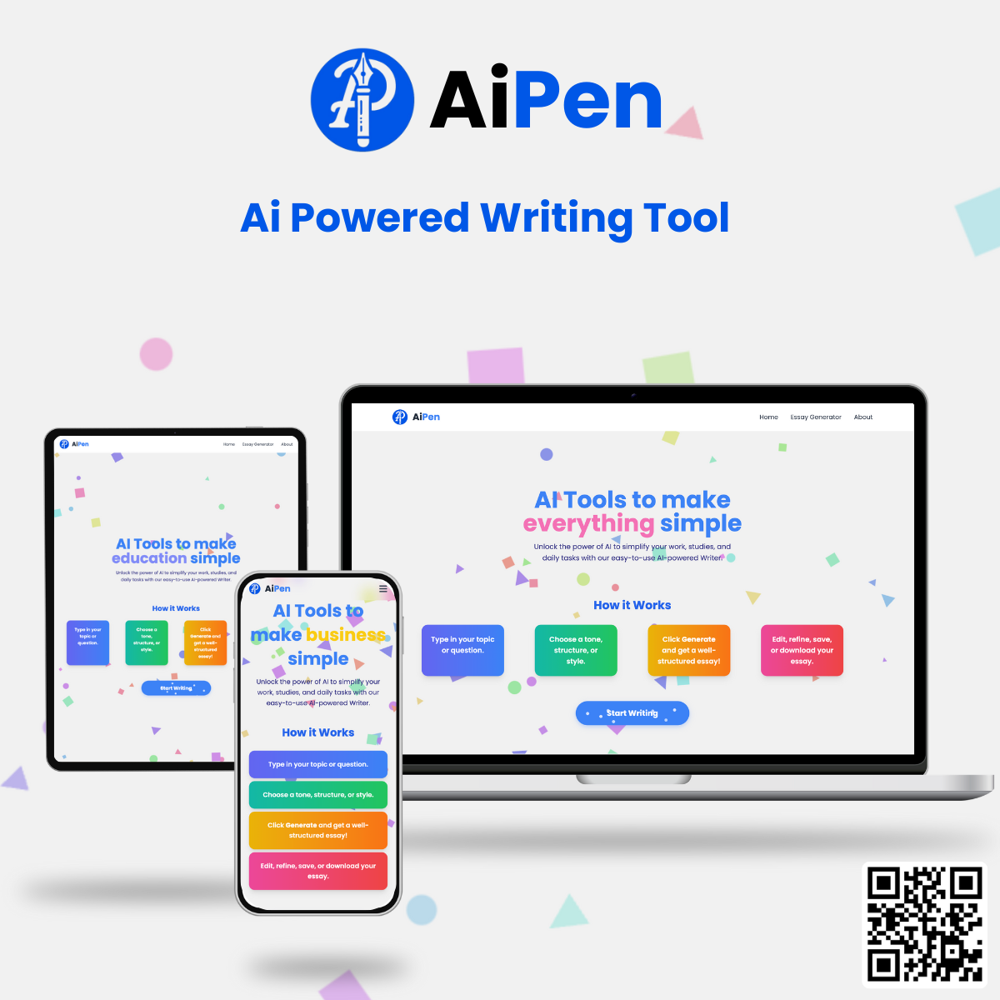

# AiPen - AI Powered Writer ✍️

AiPen is a web application designed to help users generate high-quality essays on a variety of topics using AI. With a user-friendly interface and easy-to-navigate design, AiPen allows users to input a topic and get an AI-generated essay quickly. It’s ideal for students, professionals, and anyone in need of instant writing assistance.

[Live Demo](https://aipenapp.netlify.app/)

---

## Features

- **AI-Powered Essay Generation**: Quickly generate essays on a range of topics.
- **Download and Copy Options**: Easily download or copy the generated essay.
- **Responsive Design**: Works seamlessly across desktop and mobile devices.

---

### Home Page

### Essay Generator Page

### Download Essay Option

### Mobile Responsive View

